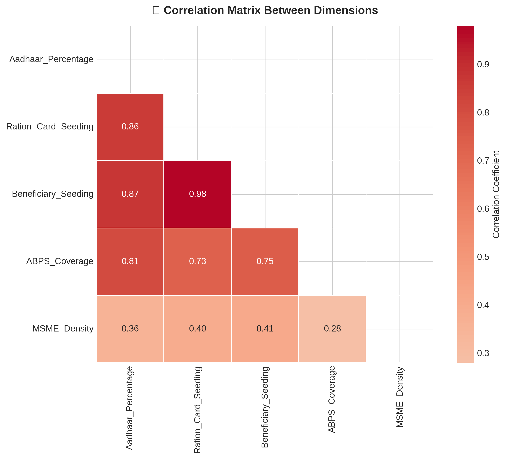
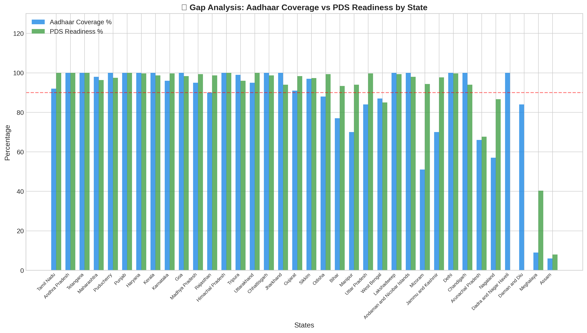

# 🏛️ Digital India Readiness Index - Executive Summary

**Dataset Period:** Multi-source UIDAI data across 10 datasets  
**Total States/UTs Analyzed:** 36  
**Analyst:** Meet Wadekar

---

## 🎯 Problem Statement

The Unique Identification Authority of India (UIDAI) has deployed Aadhaar as the cornerstone of India's digital infrastructure, enabling a wide range of citizen services including:
- **Public Distribution System (PDS)** - Ration card and beneficiary Aadhaar seeding
- **MGNREGS** - Aadhaar-Based Payment System (ABPS) for wage disbursement
- **Direct Benefit Transfer (DBT)** - Linking bank accounts for subsidy delivery
- **MSME Integration** - Formal business registration with Aadhaar linkage

**Core Challenge:** Despite widespread Aadhaar enrollment (>99% nationally), significant disparities exist in the utilization and integration of Aadhaar across states, leading to:
1. **Digital exclusion** of vulnerable populations from welfare schemes
2. **Inefficient subsidy delivery** due to incomplete beneficiary seeding
3. **Regional imbalances** particularly in North-Eastern states
4. **Data quality gaps** that hinder evidence-based policy making

This analysis aims to quantify these disparities through a composite **Digital Readiness Index** to identify priority intervention areas.

---

## 📐 Hypothesis

### Primary Hypothesis
> **States with higher Aadhaar integration across PDS, MGNREGS, and MSME ecosystems demonstrate stronger digital readiness and more efficient welfare delivery.**

### Secondary Hypotheses
1. **North-Eastern states lag significantly** in Aadhaar-based service delivery due to infrastructure constraints and geographic challenges
2. **States with 100% ration card seeding** will show correspondingly high ABPS coverage in MGNREGS
3. **MSME density correlates positively** with overall digital readiness, indicating formalization drives digital adoption
4. **Large population states** (UP, Bihar, West Bengal) may have lower per-capita digital readiness despite high absolute numbers

### Validation Metrics
| Hypothesis | Key Metric | Expected Threshold |
|------------|------------|--------------------|
| NE States Lag | Avg Index Score | <50 (vs National 70+) |
| PDS-ABPS Correlation | Pearson Coefficient | >0.6 |
| MSME-Readiness Link | Correlation | >0.4 |

---

## 📊 Key Metrics at a Glance

### Coverage Statistics
| Metric | Value |
|--------|-------|
| **Total States/UTs Analyzed** | 36 |
| **Average Digital Readiness Index** | 70.9 |
| **Median Digital Readiness Index** | 78.1 |
| **Standard Deviation** | 24.3 |

### MGNREGS ABPS Coverage
| Metric | Value |
|--------|-------|
| **Total Active Workers** | 1,496.9 Lakh |
| **ABPS Eligible Workers** | 1,043.3 Lakh |
| **National ABPS Coverage** | 69.7% |
| **Workers NOT Covered** | 453.6 Lakh ⚠️ |

### PDS Readiness (Ration Card Seeding)
| Metric | Value |
|--------|-------|
| **States with 100% Seeding** | 22 |
| **States with 0% Seeding** | 2 (Assam, Meghalaya) |
| **National Average** | 92.8% |

---

## 🏆 Top 10 States by Digital Readiness

| Rank | State | Index Score | Key Strength |
|------|-------|-------------|--------------|
| 1 | Tamil Nadu | 94.5 | Full PDS + High MSME density |
| 2 | Andhra Pradesh | 91.1 | 100% coverage across all metrics |
| 3 | Telangana | 91.0 | Excellent MGNREGS integration |
| 4 | Maharashtra | 89.3 | High MSME density + PDS |
| 5 | Puducherry | 86.7 | 100% FPS automation |
| 6 | Gujarat | 86.5 | Strong MSME ecosystem |
| 7 | Punjab | 86.4 | Complete PDS digitization |
| 8 | Karnataka | 85.7 | Balanced across all dimensions |
| 9 | Chhattisgarh | 85.1 | High beneficiary seeding |
| 10 | Haryana | 84.7 | 100% FPS automation |

---

## ⚠️ Bottom 10 States Requiring Intervention

| Rank | State | Index Score | Primary Gap |
|------|-------|-------------|-------------|
| 27 | West Bengal | 58.9 | Low Aadhaar seeding (63%) |
| 28 | Jammu and Kashmir | 54.9 | Low ABPS coverage (56%) |
| 29 | Arunachal Pradesh | 51.9 | Only 44% ration card seeding |
| 30 | Manipur | 49.9 | Low ABPS eligibility |
| 31 | Mizoram | 47.8 | Limited MSME ecosystem |
| 32 | Nagaland | 47.1 | 57% ration card seeding only |
| 33 | Dadra and Nagar Haveli | 32.9 | Missing MGNREGS data |
| 34 | Daman and Diu | 27.4 | Missing MGNREGS data |
| 35 | Meghalaya | 13.9 | 0% ration card seeding ⚠️ |
| 36 | Assam | 6.7 | 0% ration card seeding ⚠️ |

---

## 🚨 Top 5 Critical Findings

### 1. PDS Digital Exclusion (HIGH PRIORITY)
**Issue:** Assam and Meghalaya have 0% Aadhaar-ration card seeding  
**Impact:** ~40+ lakh ration cards without digital linkage in these states  
**Recommendation:** Emergency enrollment drives and mobile enrollment units in NE states

### 2. MGNREGS ABPS Gap (HIGH PRIORITY)
**Issue:** 453.6 lakh workers NOT eligible for direct wage payment via ABPS  
**Coverage:** Only 69.7% of active workers are ABPS-ready  
**Recommendation:** Expedite Aadhaar seeding campaigns for remaining 30% workers

### 3. North-Eastern States Lagging (HIGH PRIORITY)
**Issue:** NE States average readiness score of ~40 vs national average of 70.9  
**States Affected:** Assam, Meghalaya, Nagaland, Manipur, Mizoram, Arunachal Pradesh  
**Recommendation:** Dedicated regional intervention program with door-to-door enrollment

### 4. Large State Coverage Gaps (MEDIUM PRIORITY)
**Issue:** West Bengal (58.9) and Uttar Pradesh (83.2) have low scores relative to population  
**Impact:** These states represent ~25% of India's population  
**Recommendation:** Scale-up infrastructure in high-population districts

### 5. MSME-MGNREGS Correlation (MEDIUM PRIORITY)
**Issue:** States with higher MSME density show better overall readiness  
**Insight:** Formalization of economy correlates with digital service adoption  
**Recommendation:** Integrate Aadhaar enrollment with MSME registration drives

---

## 📈 Dimension-wise Analysis

### Digital Readiness Heatmap

### Top 3 vs Bottom 3 States Comparison

### Gap Analysis: Aadhaar Coverage vs PDS Readiness

---

## 🎯 Strategic Recommendations

### Immediate Actions (0-3 months)
1. ✓ Launch emergency Aadhaar seeding drives in Assam & Meghalaya
2. ✓ Deploy mobile enrollment units to remote NE areas
3. ✓ Fast-track ABPS integration for 453+ lakh unlinked MGNREGS workers
4. ✓ Establish regional monitoring dashboards for NE states

### Short-term Actions (3-6 months)
1. ✓ State-specific intervention programs for bottom 10 states
2. ✓ Training programs for FPS operators in low-automation states
3. ✓ Awareness campaigns in vernacular languages
4. ✓ Integration with other welfare schemes (DBT)

### Medium-term Actions (6-12 months)
1. ✓ Target 95% ration card seeding nationally
2. ✓ Achieve 90% MGNREGS ABPS coverage
3. ✓ Reduce regional disparity in Digital Readiness Index to <20 points
4. ✓ Quarterly progress reviews with state governments

### Long-term Goals (12+ months)
1. ✓ 100% PDS automation across all states
2. ✓ Universal Aadhaar-enabled service delivery
3. ✓ Real-time digital readiness monitoring dashboard
4. ✓ Zero exclusion due to digital barriers

---

## 📐 Methodology Highlights

### Analysis Techniques
1. **Multi-dimensional Index:** Weighted composite score across 4 key dimensions
2. **Normalization:** Min-max scaling to 0-100 for comparability
3. **Gap Analysis:** Coverage vs utilization comparisons
4. **Correlation Analysis:** Inter-dimension relationships

### Dimension Weights
| Dimension | Weight | Rationale |
|-----------|--------|-----------|
| Aadhaar Coverage | 20% | Foundation metric |
| PDS Readiness | 35% | Highest citizen impact |
| MGNREGS ABPS | 30% | Employment guarantee critical |
| MSME Density | 15% | Economic formalization indicator |

### Data Sources Used
| Dataset | Description |
|---------|-------------|
| RS_Session_254_AU_1356.csv | PDS metrics & FPS automation |
| RS_Session_246_AU2800.csv | Ration cards with deletions |
| RS_Session_254_AU_1540.1.ii_.csv | MSME data by state |
| RS_Session_260_AU_1546_C.csv | MGNREGS ABPS eligibility |
| rs_session-241_au2785_1.1.csv | Aadhaar vs 2011 census |
| + 5 additional datasets | Supporting metrics |

### Tools & Libraries
- **Data Processing:** Python, pandas, numpy
- **Visualization:** matplotlib, seaborn
- **Analysis:** Statistical aggregation, correlation analysis

---

## 📁 Deliverables

| File | Description |
|------|-------------|
| `UIDAI_Analysis.ipynb` | Complete Jupyter notebook with analysis |
| `generate_visualizations.py` | Standalone script for visualization generation |
| `data/digital_readiness_index.csv` | Master dataset with all calculations |
| `assets/state_rankings.png` | Top/Bottom 10 state rankings |
| `assets/heatmap_matrix.png` | Multi-dimensional score matrix |
| `assets/radar_chart.png` | Top 3 vs Bottom 3 comparison |
| `assets/gap_analysis.png` | Aadhaar coverage vs PDS readiness |
| `assets/correlation_matrix.png` | Dimension correlations |
| `assets/mgnregs_gap.png` | MGNREGS ABPS gap analysis |
| `assets/ne_states_analysis.png` | North-Eastern states focus |
| `assets/distribution_analysis.png` | Index distribution |

---
