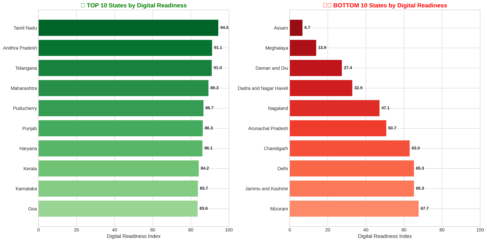
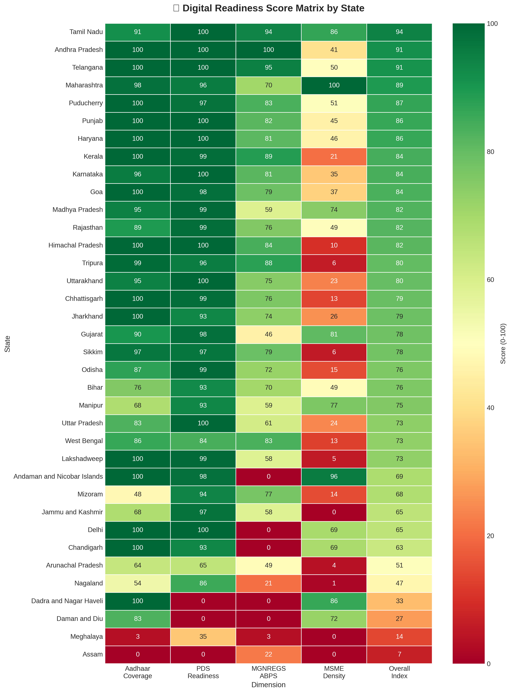
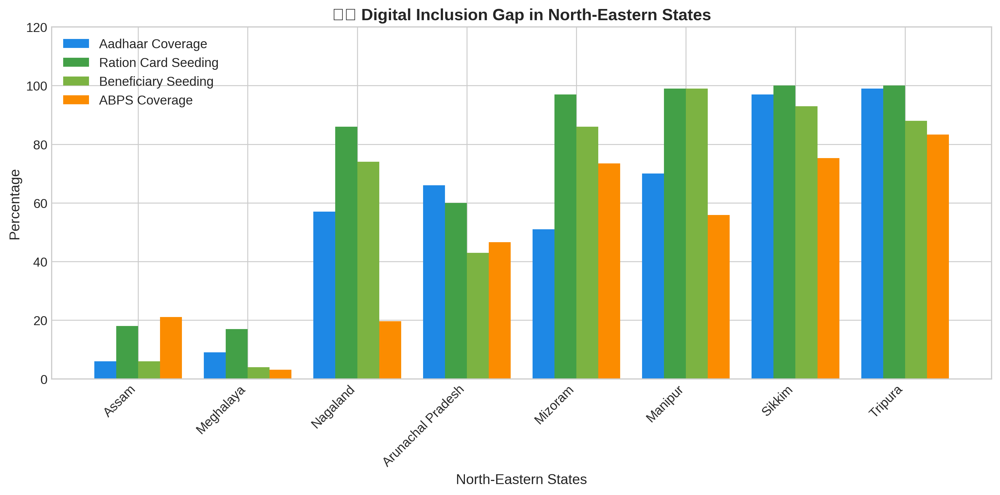

# UIDAI-2026-Hackathon-Meet-Wadekar

# 🏛️ Digital India Readiness Index Analysis (UIDAI-DATA-HACKATHON-2026)

## Project Overview

This project, developed for the **UIDAI-DATA-HACKATHON-2026**, presents a comprehensive multi-dimensional analysis of India's digital service delivery readiness across the Aadhaar ecosystem. The analysis measures state-wise Digital Readiness Index (DRI) to identify disparities, quantify gaps, and provide strategic recommendations for inclusive welfare distribution.

## Problem Statement

> **"Measuring State-wise Digital Service Delivery Readiness: A Multi-dimensional Analysis of Aadhaar Ecosystem Health for Inclusive Welfare Distribution"**

Despite widespread Aadhaar enrollment (>99% nationally), significant disparities exist in the utilization and integration of Aadhaar across states, leading to:
- Digital exclusion of vulnerable populations from welfare schemes
- Inefficient subsidy delivery due to incomplete beneficiary seeding
- Regional imbalances, particularly in North-Eastern states
- Data quality gaps that hinder evidence-based policy making

## Hypothesis

**Primary Hypothesis:** States with higher Aadhaar integration across PDS, MGNREGS, and MSME ecosystems demonstrate stronger digital readiness and more efficient welfare delivery.

**Secondary Hypotheses:**
- North-Eastern states lag significantly in Aadhaar-based service delivery
- States with 100% ration card seeding show correspondingly high ABPS coverage
- MSME density correlates positively with overall digital readiness

## Data Scope

| Parameter | Value |
|-----------|-------|
| **Dataset Period** | Multi-source UIDAI data across 10 datasets |
| **Total States/UTs Analyzed** | 36 |
| **Dimensions Analyzed** | Aadhaar Coverage, PDS Readiness, MGNREGS ABPS, MSME Density |

## Key Findings

### Coverage Statistics
| Metric | Value |
|--------|-------|
| Average Digital Readiness Index | **70.9** |
| Median Digital Readiness Index | **78.1** |
| Standard Deviation | **24.3** |

### Critical Findings

1. **PDS Digital Exclusion (HIGH PRIORITY)**
   - Assam and Meghalaya have **0% Aadhaar-ration card seeding**
   - Impact: ~40+ lakh ration cards without digital linkage

2. **MGNREGS ABPS Gap (HIGH PRIORITY)**
   - **453.6 lakh workers** NOT eligible for direct wage payment via ABPS
   - Only **69.7%** of active workers are ABPS-ready

3. **North-Eastern States Lagging (HIGH PRIORITY)**
   - NE States average readiness score: **~40** vs national average: **70.9**
   - Affected: Assam, Meghalaya, Nagaland, Manipur, Mizoram, Arunachal Pradesh

4. **Large State Coverage Gaps (MEDIUM PRIORITY)**
   - West Bengal (58.9) and UP (83.2) have low scores relative to population
   - These states represent ~25% of India's population

### Top 5 Performing States
| Rank | State | DRI Score |
|------|-------|-----------|
| 1 | Tamil Nadu | 94.5 |
| 2 | Andhra Pradesh | 91.1 |
| 3 | Telangana | 91.0 |
| 4 | Maharashtra | 89.3 |
| 5 | Puducherry | 86.7 |

### Bottom 5 States Requiring Intervention
| Rank | State | DRI Score |
|------|-------|-----------|
| 32 | Nagaland | 47.1 |
| 33 | D&N Haveli | 32.9 |
| 34 | Daman & Diu | 27.4 |
| 35 | Meghalaya | 13.9 |
| 36 | Assam | 6.7 |

## Methodology

### Multi-dimensional Index Calculation

The Digital Readiness Index (DRI) is calculated using a weighted composite score:

| Dimension | Weight | Rationale |
|-----------|--------|-----------|
| Aadhaar Coverage | 20% | Foundation metric |
| PDS Readiness | 35% | Highest citizen impact |
| MGNREGS ABPS | 30% | Employment guarantee critical |
| MSME Density | 15% | Economic formalization indicator |

### Analysis Techniques
- **Normalization:** Min-max scaling to 0-100 for comparability
- **Gap Analysis:** Coverage vs utilization comparisons
- **Correlation Analysis:** Inter-dimension relationships
- **Regional Analysis:** Special focus on North-Eastern states

## Strategic Recommendations

### Immediate Actions (0-3 months)
- ✅ Launch emergency Aadhaar seeding drives in Assam & Meghalaya
- ✅ Deploy mobile enrollment units to remote NE areas
- ✅ Fast-track ABPS integration for 453+ lakh unlinked workers

### Short-term Actions (3-6 months)
- ✅ State-specific intervention programs for bottom 10 states
- ✅ Training programs for FPS operators in low-automation states
- ✅ Awareness campaigns in vernacular languages

### Medium-term Actions (6-12 months)
- ✅ Target 95% ration card seeding nationally
- ✅ Achieve 90% MGNREGS ABPS coverage
- ✅ Reduce regional disparity in DRI to <20 points

## Repository Structure

```
UIDAI/
├── README.md                      # This file
├── EXECUTIVE_SUMMARY.md           # Detailed executive summary
├── EXECUTIVE_SUMMARY.pdf          # PDF report with visualizations
├── UIDAI_Analysis.ipynb           # Complete Jupyter notebook analysis
├── generate_visualizations.py     # Standalone visualization script
├── generate_pdf.py                # PDF generation script
├── assets/                        # Visualization images
│   ├── state_rankings.png
│   ├── heatmap_matrix.png
│   ├── radar_chart.png
│   ├── gap_analysis.png
│   ├── correlation_matrix.png
│   ├── mgnregs_gap.png
│   ├── ne_states_analysis.png
│   └── distribution_analysis.png
└── data/                          # Source CSV datasets
    ├── RS_Session_254_AU_1356.csv
    ├── RS_Session_246_AU2800.csv
    ├── RS_Session_254_AU_1540.1.ii_.csv
    ├── RS_Session_260_AU_1546_C.csv
    └── ... (11 CSV files total)
```

## Visualizations

### State Rankings


### Digital Readiness Heatmap


### North-Eastern States Analysis


## Technical Stack

| Component | Technology |
|-----------|------------|
| **Language** | Python 3.12 |
| **Data Processing** | pandas, numpy |
| **Visualization** | matplotlib, seaborn |
| **Analysis** | Statistical aggregation, correlation analysis |
| **PDF Generation** | fpdf2 |
| **Notebook** | Jupyter |

## How to Run

### Prerequisites
```bash
# Create virtual environment
python3 -m venv venv
source venv/bin/activate

# Install dependencies
pip install pandas numpy matplotlib seaborn fpdf2
```

### Generate Visualizations
```bash
python generate_visualizations.py
```

### Generate PDF Report
```bash
python generate_pdf.py
```

### Run Jupyter Notebook
```bash
jupyter notebook UIDAI_Analysis.ipynb
```

## Deliverables

| File | Description |
|------|-------------|
| `EXECUTIVE_SUMMARY.pdf` | Complete PDF report with all visualizations |
| `UIDAI_Analysis.ipynb` | Jupyter notebook with full analysis |
| `digital_readiness_index.csv` | Master dataset with calculated indices |
| `assets/*.png` | All visualization images |

## Team

**Analyst:** Meet Wadekar

---

*Developed for UIDAI Data Hackathon 2026*
